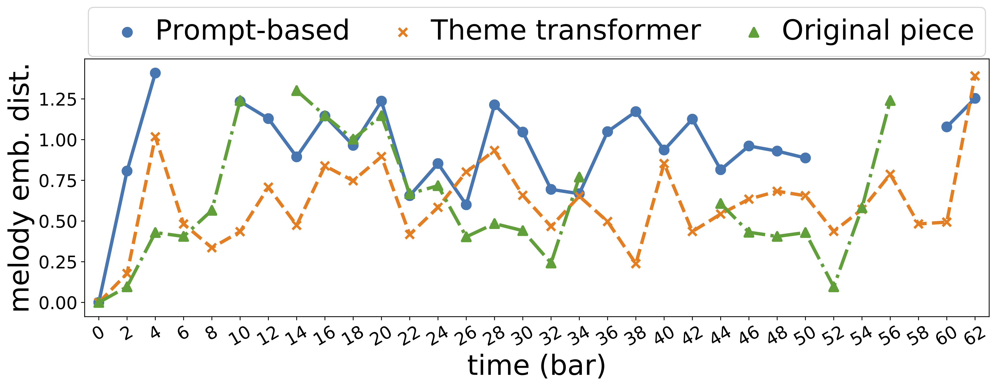
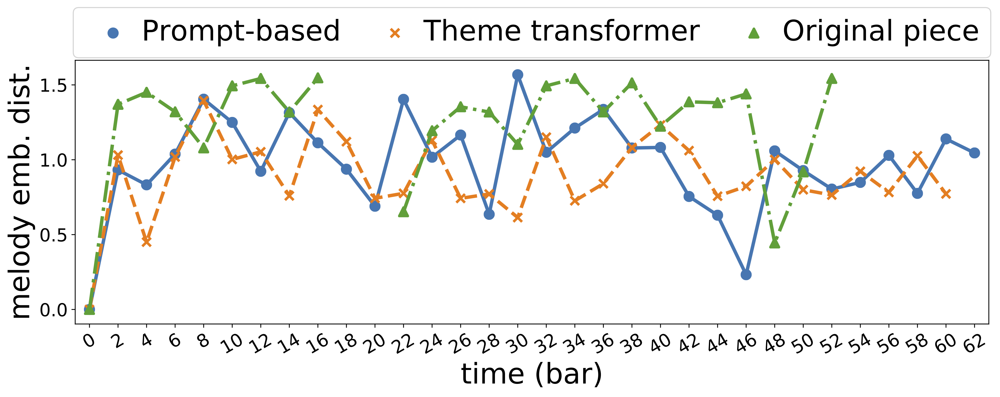
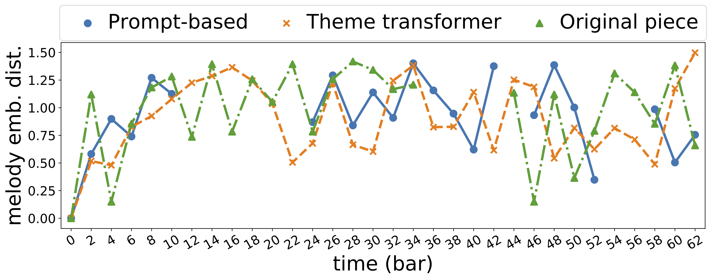
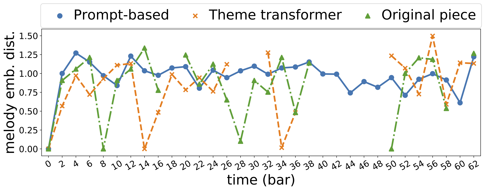
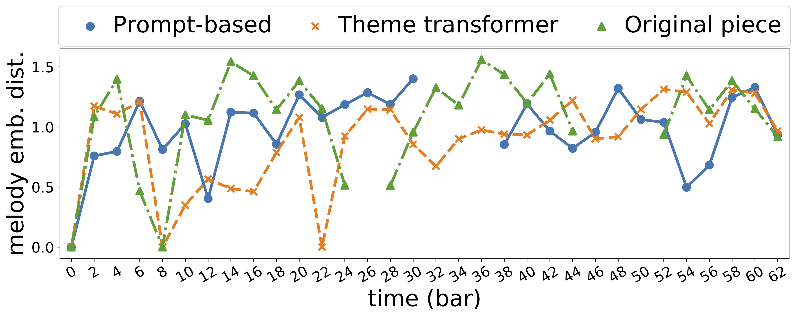
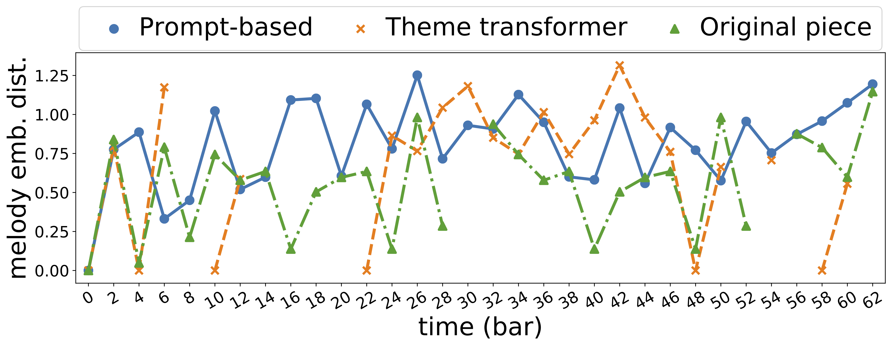
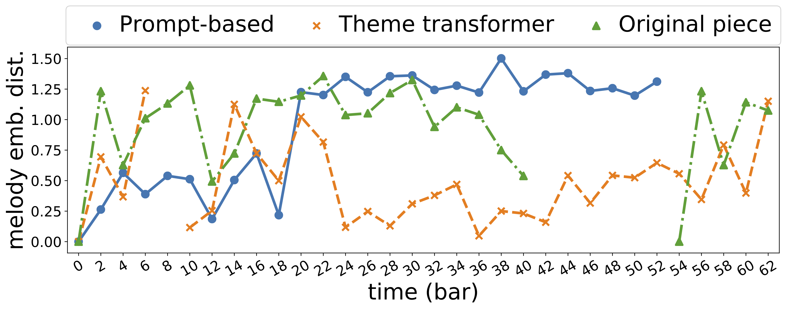
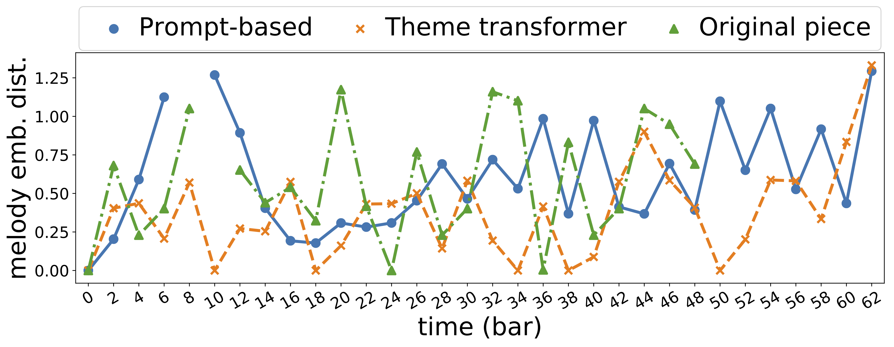
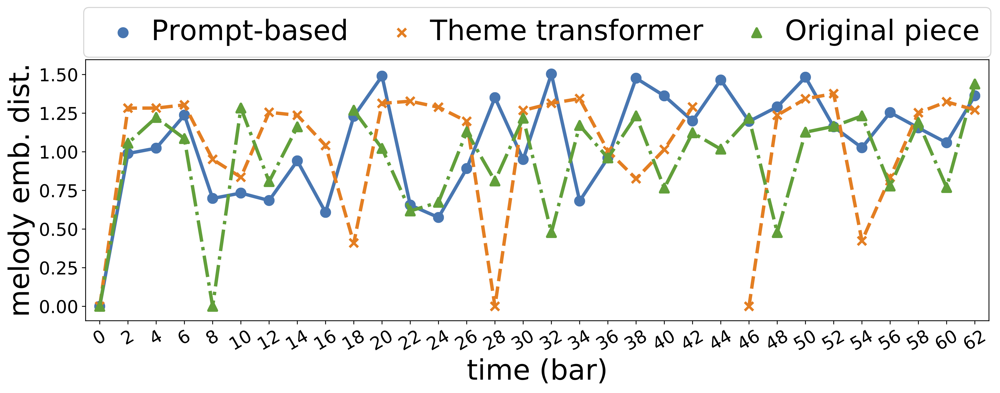
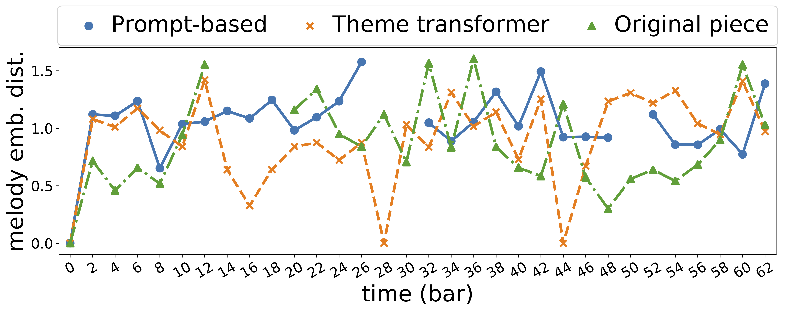

---
#
# Here you can change the text shown in the Home page before the Latest Posts section.
#
# Edit cayman-blog's home layout in _layouts instead if you wanna make some changes
# See: https://jekyllrb.com/docs/themes/#overriding-theme-defaults
#
layout: home
title: "Theme Transformer"
ref: demo
---

## Abstract

Attention-based Transformer models have been increasingly employed for automatic music generation. To condition the generation process of such a model with a user-specified sequence, a popular approach is to take that conditioning sequence as a priming sequence and ask a Transformer decoder to generate a continuation. However, this *prompt-based conditioning* cannot guarantee that the conditioning sequence would develop or even simply repeat itself in the generated continuation. In this paper, we propose an alternative conditioning approach, called *theme-based conditioning*, that explicitly trains the Transformer to treat the conditioning sequence as a thematic material that has to manifest itself multiple times in its generation result. This is achieved with two main technical contributions. First, we propose a deep learning-based approach that uses contrastive representation learning and clustering to automatically retrieve thematic materials from music pieces in the training data. Second, we propose a novel gated parallel attention module to be used in a sequence-to-sequence (seq2seq) encoder/decoder architecture to more effectively account for a given conditioning thematic material in the generation process of the Transformer decoder. We report on objective and subjective evaluations of variants of the proposed Theme Transformer and the conventional prompt-based baseline, showing that our best model can generate, to some extent, polyphonic pop piano music with repetition and plausible variations of a given condition.

## Demo
### Audio Samples

| ID| Theme | Real Data | Baseline | Theme Transformer
| -- | -------- | -------- | -------- | -------- |
| 875 | <audio controls><source src="theme-transformer-audio/875_Theme.mp3" type="audio/mp3">Your browser does not support the audio element.</audio> | <audio controls><source src="theme-transformer-audio/875_Realdata.mp3" type="audio/mp3">Your browser does not support the audio element.</audio> | <audio controls><source src="theme-transformer-audio/875_Baseline.mp3" type="audio/mp3">Your browser does not support the audio element.</audio> | <audio controls><source src="theme-transformer-audio/875_ThemeTransformer.mp3" type="audio/mp3">Your browser does not support the audio element.</audio>|
| 888 | <audio controls><source src="theme-transformer-audio/888_Theme.mp3" type="audio/mp3">Your browser does not support the audio element.</audio> | <audio controls><source src="theme-transformer-audio/888_Realdata.mp3" type="audio/mp3">Your browser does not support the audio element.</audio> | <audio controls><source src="theme-transformer-audio/888_Baseline.mp3" type="audio/mp3">Your browser does not support the audio element.</audio> | <audio controls><source src="theme-transformer-audio/888_ThemeTransformer.mp3" type="audio/mp3">Your browser does not support the audio element.</audio>|
| 890 | <audio controls><source src="theme-transformer-audio/890_Theme.mp3" type="audio/mp3">Your browser does not support the audio element.</audio> | <audio controls><source src="theme-transformer-audio/890_Realdata.mp3" type="audio/mp3">Your browser does not support the audio element.</audio> | <audio controls><source src="theme-transformer-audio/890_Baseline.mp3" type="audio/mp3">Your browser does not support the audio element.</audio> | <audio controls><source src="theme-transformer-audio/890_ThemeTransformer.mp3" type="audio/mp3">Your browser does not support the audio element.</audio>|
| 893 | <audio controls><source src="theme-transformer-audio/893_Theme.mp3" type="audio/mp3">Your browser does not support the audio element.</audio> | <audio controls><source src="theme-transformer-audio/893_Realdata.mp3" type="audio/mp3">Your browser does not support the audio element.</audio> | <audio controls><source src="theme-transformer-audio/893_Baseline.mp3" type="audio/mp3">Your browser does not support the audio element.</audio> | <audio controls><source src="theme-transformer-audio/893_ThemeTransformer.mp3" type="audio/mp3">Your browser does not support the audio element.</audio>|
| 899 | <audio controls><source src="theme-transformer-audio/899_Theme.mp3" type="audio/mp3">Your browser does not support the audio element.</audio> | <audio controls><source src="theme-transformer-audio/899_Realdata.mp3" type="audio/mp3">Your browser does not support the audio element.</audio> | <audio controls><source src="theme-transformer-audio/899_Baseline.mp3" type="audio/mp3">Your browser does not support the audio element.</audio> | <audio controls><source src="theme-transformer-audio/899_ThemeTransformer.mp3" type="audio/mp3">Your browser does not support the audio element.</audio>|
| 900 | <audio controls><source src="theme-transformer-audio/900_Theme.mp3" type="audio/mp3">Your browser does not support the audio element.</audio> | <audio controls><source src="theme-transformer-audio/900_Realdata.mp3" type="audio/mp3">Your browser does not support the audio element.</audio> | <audio controls><source src="theme-transformer-audio/900_Baseline.mp3" type="audio/mp3">Your browser does not support the audio element.</audio> | <audio controls><source src="theme-transformer-audio/900_ThemeTransformer.mp3" type="audio/mp3">Your browser does not support the audio element.</audio>|
| 901 | <audio controls><source src="theme-transformer-audio/901_Theme.mp3" type="audio/mp3">Your browser does not support the audio element.</audio> | <audio controls><source src="theme-transformer-audio/901_Realdata.mp3" type="audio/mp3">Your browser does not support the audio element.</audio> | <audio controls><source src="theme-transformer-audio/901_Baseline.mp3" type="audio/mp3">Your browser does not support the audio element.</audio> | <audio controls><source src="theme-transformer-audio/901_ThemeTransformer.mp3" type="audio/mp3">Your browser does not support the audio element.</audio>|
| 904 | <audio controls><source src="theme-transformer-audio/904_Theme.mp3" type="audio/mp3">Your browser does not support the audio element.</audio> | <audio controls><source src="theme-transformer-audio/904_Realdata.mp3" type="audio/mp3">Your browser does not support the audio element.</audio> | <audio controls><source src="theme-transformer-audio/904_Baseline.mp3" type="audio/mp3">Your browser does not support the audio element.</audio> | <audio controls><source src="theme-transformer-audio/904_ThemeTransformer.mp3" type="audio/mp3">Your browser does not support the audio element.</audio>|
| 908 | <audio controls><source src="theme-transformer-audio/908_Theme.mp3" type="audio/mp3">Your browser does not support the audio element.</audio> | <audio controls><source src="theme-transformer-audio/908_Realdata.mp3" type="audio/mp3">Your browser does not support the audio element.</audio> | <audio controls><source src="theme-transformer-audio/908_Baseline.mp3" type="audio/mp3">Your browser does not support the audio element.</audio> | <audio controls><source src="theme-transformer-audio/908_ThemeTransformer.mp3" type="audio/mp3">Your browser does not support the audio element.</audio>|
| 909 | <audio controls><source src="theme-transformer-audio/909_Theme.mp3" type="audio/mp3">Your browser does not support the audio element.</audio> | <audio controls><source src="theme-transformer-audio/909_Realdata.mp3" type="audio/mp3">Your browser does not support the audio element.</audio> | <audio controls><source src="theme-transformer-audio/909_Baseline.mp3" type="audio/mp3">Your browser does not support the audio element.</audio> | <audio controls><source src="theme-transformer-audio/909_ThemeTransformer.mp3" type="audio/mp3">Your browser does not support the audio element.</audio>|


### Figures

<table>
<colgroup>
    <col width="5%" />
    <col width="47.5%" />
    <col width="47.5%" />
</colgroup>
<thead>
    <tr class="header">
    <th>id</th>
    <th>First 24 bars</th>
    <th>Melody Embedding Distance</th>
    </tr>
</thead>
<tbody>
<tr>
<td markdown="span">**875**</td>
<td markdown="span"></td>
<td markdown="span"></td>
</tr>
<tr>
<td markdown="span">**888**</td>
<td markdown="span"></td>
<td markdown="span"></td>
</tr>
<tr>
<td markdown="span">**890**</td>
<td markdown="span"></td>
<td markdown="span"></td>
</tr>
<tr>
<td markdown="span">**893**</td>
<td markdown="span"></td>
<td markdown="span"></td>
</tr>
<tr>
<td markdown="span">**894**</td>
<td markdown="span"></td>
<td markdown="span"></td>
</tr>
<tr>
<td markdown="span">**896**</td>
<td markdown="span"></td>
<td markdown="span"></td>
</tr>
<tr>
<td markdown="span">**899**</td>
<td markdown="span"></td>
<td markdown="span"></td>
</tr>
<tr>
<td markdown="span">**900**</td>
<td markdown="span"></td>
<td markdown="span"></td>
</tr>
<tr>
<td markdown="span">**901**</td>
<td markdown="span"></td>
<td markdown="span"></td>
</tr>
<tr>
<td markdown="span">**904**</td>
<td markdown="span"></td>
<td markdown="span"></td>
</tr>
<tr>
<td markdown="span">**908**</td>
<td markdown="span"></td>
<td markdown="span"></td>
</tr>
<tr>
<td markdown="span">**909**</td>
<td markdown="span"></td>
<td markdown="span"></td>
</tr>
</tbody></table>

## Qualitative results for Theme Retrieval 

Midi ID       | Piano Roll (.png) | Piano Roll (webpage) | Midi Files |
--------------|-------|-------|-------|
065    | [Link](thmret/pianoRollPngs/065.png) | [Link](thmret/pianoRollHtml/065.html) | [Link](thmret/065.zip) | 
284    | [Link](thmret/pianoRollPngs/284.png) | [Link](thmret/pianoRollHtml/284.html) | [Link](thmret/284.zip) | 
310    | [Link](thmret/pianoRollPngs/310.png) | [Link](thmret/pianoRollHtml/310.html) | [Link](thmret/310.zip) | 
422    | [Link](thmret/pianoRollPngs/422.png) | [Link](thmret/pianoRollHtml/422.html) | [Link](thmret/422.zip) | 
449    | [Link](thmret/pianoRollPngs/449.png) | [Link](thmret/pianoRollHtml/449.html) | [Link](thmret/449.zip) | 
464    | [Link](thmret/pianoRollPngs/464.png) | [Link](thmret/pianoRollHtml/464.html) | [Link](thmret/464.zip) | 


## Comparision for Different Sampling Temperature on Inference phase

File: [temperature_comparison.zip](thmret/temp_and_eps/temperature_comparison.zip)

## Comparision for Different Eps in DBSCAN

File: [eps_comparison.zip](thmret/temp_and_eps/eps_comparison.zip)

## Citation
If you find this work helpful and use our code in your research, please kindly cite our paper:
```
@article{shih2021theme,
      title={Theme Transformer: Symbolic Music Generation with Theme-Conditioned Transformer}, 
      author={Yi-Jen Shih and Shih-Lun Wu and Frank Zalkow and Meinard Müller and Yi-Hsuan Yang},
      year={2021},
      eprint={2111.04093},
      archivePrefix={arXiv},
      primaryClass={cs.SD}
}
```
