---
#
# Here you can change the text shown in the Home page before the Latest Posts section.
#
# Edit cayman-blog's home layout in _layouts instead if you wanna make some changes
# See: https://jekyllrb.com/docs/themes/#overriding-theme-defaults
#
layout: home
title: "Theme Transformer"
---

### Abstract
<!-- Theme Transformer: Symbolic Music Generation with Theme-Conditioned Transformer -->

At the core of a Transformer model lies the so-called self-attention mechanism that supplies its autoregressive generation process with long-term memory. To exert control over the generation process of the Transformer, a popular and universal approach is to "prompt" the Transformer with a user-specified sequence and ask the model to generate a continuation. When using neural networks for music generation, the self-attention mechanism contributes to the consistency of the generated pieces in harmony and style. However, we argue in this paper that the self-attention mechanism alone is not sufficient for music applications because it cannot guarantee that the prompt would repeat itself or manifest in some way in the generated continuation. To improve this shortcoming, we propose an alternative conditioning approach, named theme-based conditioning, that explicitly coaches the Transformer to have multiple occurrences of the given condition, or a ``theme,'' in its generation. Technically, this is achieved by associating a theme with its occurrences in a training piece by contrastive representation learning and clustering, and by establishing a separate and dedicated memory network for the conditioning theme, so that the Transformer can self-attend to the long-term memory and cross-attend to the theme in parallel. We report on objective and subjective evaluations of variants of the proposed Theme Transformer and the conventional prompt-based baseline, showing that our best model can generate, to some extent, polyphonic pop piano music with repetition and plausible variations of the given condition. 

### Demo

| ID| Theme | Real Data | Baseline | Theme Transformer
| -- | -------- | -------- | -------- | -------- |
| 875 | <audio controls><source src="theme-transformer-audio/875_Theme.mp3" type="audio/mp3">Your browser does not support the audio element.</audio> | <audio controls><source src="theme-transformer-audio/875_Realdata.mp3" type="audio/mp3">Your browser does not support the audio element.</audio> | <audio controls><source src="theme-transformer-audio/875_Baseline.mp3" type="audio/mp3">Your browser does not support the audio element.</audio> | <audio controls><source src="theme-transformer-audio/875_ThemeTransformer.mp3" type="audio/mp3">Your browser does not support the audio element.</audio>|
| 888 | <audio controls><source src="theme-transformer-audio/888_Theme.mp3" type="audio/mp3">Your browser does not support the audio element.</audio> | <audio controls><source src="theme-transformer-audio/888_Realdata.mp3" type="audio/mp3">Your browser does not support the audio element.</audio> | <audio controls><source src="theme-transformer-audio/888_Baseline.mp3" type="audio/mp3">Your browser does not support the audio element.</audio> | <audio controls><source src="theme-transformer-audio/888_ThemeTransformer.mp3" type="audio/mp3">Your browser does not support the audio element.</audio>|
| 890 | <audio controls><source src="theme-transformer-audio/890_Theme.mp3" type="audio/mp3">Your browser does not support the audio element.</audio> | <audio controls><source src="theme-transformer-audio/890_Realdata.mp3" type="audio/mp3">Your browser does not support the audio element.</audio> | <audio controls><source src="theme-transformer-audio/890_Baseline.mp3" type="audio/mp3">Your browser does not support the audio element.</audio> | <audio controls><source src="theme-transformer-audio/890_ThemeTransformer.mp3" type="audio/mp3">Your browser does not support the audio element.</audio>|
| 893 | <audio controls><source src="theme-transformer-audio/893_Theme.mp3" type="audio/mp3">Your browser does not support the audio element.</audio> | <audio controls><source src="theme-transformer-audio/893_Realdata.mp3" type="audio/mp3">Your browser does not support the audio element.</audio> | <audio controls><source src="theme-transformer-audio/893_Baseline.mp3" type="audio/mp3">Your browser does not support the audio element.</audio> | <audio controls><source src="theme-transformer-audio/893_ThemeTransformer.mp3" type="audio/mp3">Your browser does not support the audio element.</audio>|
| 899 | <audio controls><source src="theme-transformer-audio/899_Theme.mp3" type="audio/mp3">Your browser does not support the audio element.</audio> | <audio controls><source src="theme-transformer-audio/899_Realdata.mp3" type="audio/mp3">Your browser does not support the audio element.</audio> | <audio controls><source src="theme-transformer-audio/899_Baseline.mp3" type="audio/mp3">Your browser does not support the audio element.</audio> | <audio controls><source src="theme-transformer-audio/899_ThemeTransformer.mp3" type="audio/mp3">Your browser does not support the audio element.</audio>|
| 900 | <audio controls><source src="theme-transformer-audio/900_Theme.mp3" type="audio/mp3">Your browser does not support the audio element.</audio> | <audio controls><source src="theme-transformer-audio/900_Realdata.mp3" type="audio/mp3">Your browser does not support the audio element.</audio> | <audio controls><source src="theme-transformer-audio/900_Baseline.mp3" type="audio/mp3">Your browser does not support the audio element.</audio> | <audio controls><source src="theme-transformer-audio/900_ThemeTransformer.mp3" type="audio/mp3">Your browser does not support the audio element.</audio>|
| 901 | <audio controls><source src="theme-transformer-audio/901_Theme.mp3" type="audio/mp3">Your browser does not support the audio element.</audio> | <audio controls><source src="theme-transformer-audio/901_Realdata.mp3" type="audio/mp3">Your browser does not support the audio element.</audio> | <audio controls><source src="theme-transformer-audio/901_Baseline.mp3" type="audio/mp3">Your browser does not support the audio element.</audio> | <audio controls><source src="theme-transformer-audio/901_ThemeTransformer.mp3" type="audio/mp3">Your browser does not support the audio element.</audio>|
| 904 | <audio controls><source src="theme-transformer-audio/904_Theme.mp3" type="audio/mp3">Your browser does not support the audio element.</audio> | <audio controls><source src="theme-transformer-audio/904_Realdata.mp3" type="audio/mp3">Your browser does not support the audio element.</audio> | <audio controls><source src="theme-transformer-audio/904_Baseline.mp3" type="audio/mp3">Your browser does not support the audio element.</audio> | <audio controls><source src="theme-transformer-audio/904_ThemeTransformer.mp3" type="audio/mp3">Your browser does not support the audio element.</audio>|
| 908 | <audio controls><source src="theme-transformer-audio/908_Theme.mp3" type="audio/mp3">Your browser does not support the audio element.</audio> | <audio controls><source src="theme-transformer-audio/908_Realdata.mp3" type="audio/mp3">Your browser does not support the audio element.</audio> | <audio controls><source src="theme-transformer-audio/908_Baseline.mp3" type="audio/mp3">Your browser does not support the audio element.</audio> | <audio controls><source src="theme-transformer-audio/908_ThemeTransformer.mp3" type="audio/mp3">Your browser does not support the audio element.</audio>|
| 909 | <audio controls><source src="theme-transformer-audio/909_Theme.mp3" type="audio/mp3">Your browser does not support the audio element.</audio> | <audio controls><source src="theme-transformer-audio/909_Realdata.mp3" type="audio/mp3">Your browser does not support the audio element.</audio> | <audio controls><source src="theme-transformer-audio/909_Baseline.mp3" type="audio/mp3">Your browser does not support the audio element.</audio> | <audio controls><source src="theme-transformer-audio/909_ThemeTransformer.mp3" type="audio/mp3">Your browser does not support the audio element.</audio>|

### Figures

<table>
<colgroup>
<col width="10%" />
<col width="45%" />
<col width="45%" />
</colgroup>
<thead>
<tr class="header">
<th>id</th>
<th>First 24 bars</th>
<th>Melody Embedding Distance</th>
</tr>
</thead>
<tbody>
<tr>
<td markdown="span">**875**</td>
<td markdown="span">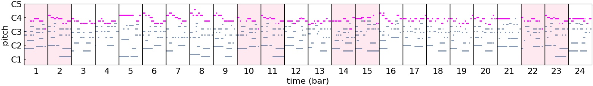</td>
<td markdown="span"></td>
</tr>
<tr>
<td markdown="span">**888**</td>
<td markdown="span">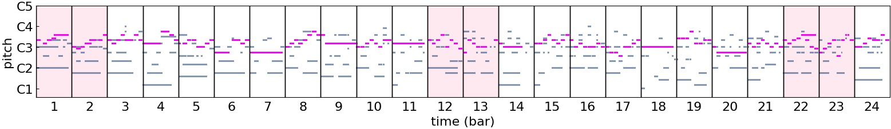</td>
<td markdown="span"></td>
<tr>
<td markdown="span">**890**</td>
<td markdown="span">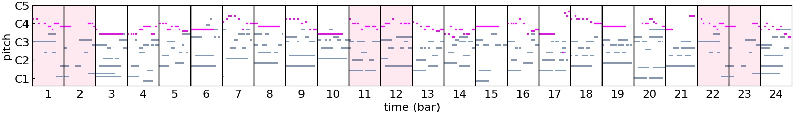</td>
<td markdown="span"></td>
<tr>
<td markdown="span">**893**</td>
<td markdown="span">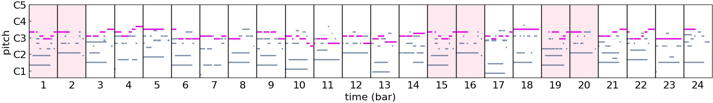</td>
<td markdown="span"></td>
<tr>
<td markdown="span">**894**</td>
<td markdown="span">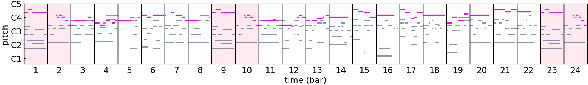</td>
<td markdown="span"></td>
<tr>
<td markdown="span">**896**</td>
<td markdown="span">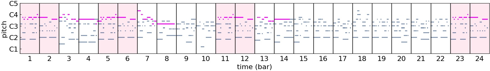</td>
<td markdown="span"></td>
<tr>
<td markdown="span">**899**</td>
<td markdown="span">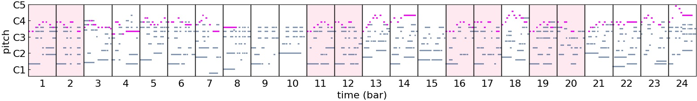</td>
<td markdown="span"></td>
<tr>
<td markdown="span">**900**</td>
<td markdown="span">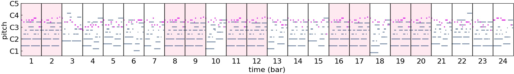</td>
<td markdown="span"></td>
<tr>
<td markdown="span">**901**</td>
<td markdown="span">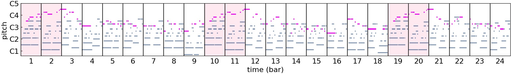</td>
<td markdown="span"></td>
<tr>
<td markdown="span">**904**</td>
<td markdown="span">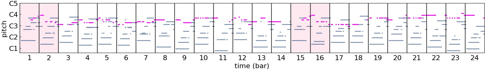</td>
<td markdown="span"></td>
<tr>
<td markdown="span">**908**</td>
<td markdown="span">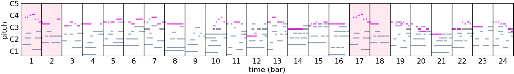</td>
<td markdown="span"></td>
<tr>
<td markdown="span">**909**</td>
<td markdown="span">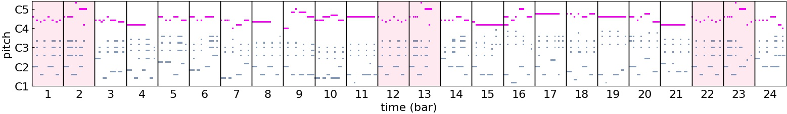</td>
<td markdown="span"></td>
</tbody>
</table>

