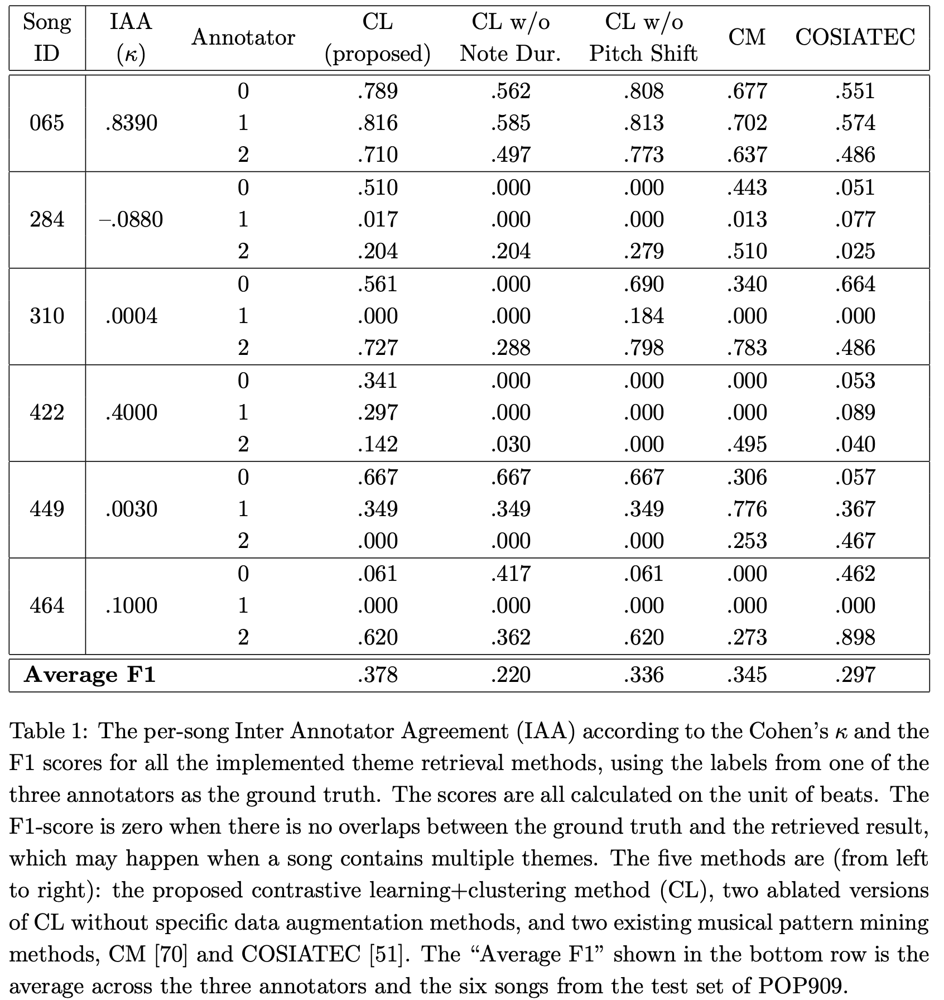

## Details for Theme Retrieval 

### Evaluation and Baselines

To quantitatively evaluate the proposed contrastive learning and clustering method for theme retrieval, we need a dataset of musically-meaningful manual labels of 1) the theme of a song and 2) its occurrence in that song. However, manual labeling the themes and their occurrence requires significant time and musical expertise, and possibly more importantly, is by nature a subjective task. We are unfortunately not aware of any datasets of pop songs
that provide manual labeling of themes, making it hard to perform the evaluation. 

The only two existing datasets that can be considered as partially relevant, are the [JKU Pattern Development Database](http://tomcollinsresearch.net/research/data/mirex/JKUPDD-Aug2013.zip]) that was used in the MIREX task of “Discovery of Repeated Themes & Sections” for a few years [49, 50, 51, 52, 70], and the [MTD Dataset](https://www.audiolabs-erlangen.de/resources/MIR/MTD) which was proposed lately [3]. The former is about finding repetitive “musical patterns”, which can be of arbitrary length (i.e., can be too short or too long) and do not necessarily correspond to musical themes. The JKU dataset is for Western classical music, not pop music. The MTD dataset, on the other hand, specifies the theme of a musical piece by referring to the book [A Dictionary of
Musical Themes](https://en.wikipedia.org/wiki/A_Dictionary_of_Musical_Themes) and as such is for Western classical music again. Besides difference in musical genre, the MTD dataset only specifies what the theme is, without specifying where the theme manifests itself in the piece (i.e., its occurrence). Therefore, we do not think that these two datasets are suitable for quantifying the performance of our theme retrieval method.

In view of the importance of such an evaluation, we decided to launch a small-scale manual annotation campaign that invites three friends of us who have some musical training to annotate the theme and its occurrences of six songs from the test set of POP909. We had three annotators to account for the possible subjectivity of the theme labeling. We explained to them the meaning of themes and instructed them that 

1. The labeling is by nature subjective so they are feel to use their own judgement
2. There is no need to align either the beginning or the end of a theme region to the bar lines
3. A theme region should roughly correspond to a music phrase and its length might be about 2 to 4 bars. 

The annotators used the MIDI editor available on their own computer to annotate the beat indices that they consider belonging to the theme regions. In our best efforts in making the evaluation as comprehensive as possible, we intended to use the aforementioned small labeled dataset to conduct not only ablation studies for the proposed data augmentation method, but also to evaluate existing methods to validate the effectiveness of the proposed contrastive learning and clustering method. For ablation study, we implement two versions of the proposed contrastive learning (CL)-based method—one with only the “Pitch shift on scale” augmentation and the other with only the *“Last note duration variation”* and *“Note splitting and combination”* augmentation.

We are not aware of any existing symbolic-domain theme retrieval methods. Therefore, we implemented the following two existing pattern finding algorithms instead.

* The **Correlative matrix** (CM) method [70] searches for closed-pattern in a one-dimensional string. Specifically, the method represents melody pitches in morphetic symbols and concatenates them into a “melody string.” Then, it mines closed patterns from the melody string. In addition, believing that most themes in a piece of classical music are composed of less than 30 notes, the CM method considers the longest melody sub-string that is less than 30 symbols and that repeats at least twice as the theme.
* The **COSIATEC** method [51], on the other hand, views the melody notes as dots in a 2-dimensional space of {onset, pitch} and then extracts the so-called “translational equivalence class” (TEC) groups from the melody. Believing that a musically meaning pattern should be compact by nature, the COSIATEC method repeatedly extracts TEC groups and chooses the one with the highest compactness ratio. The process keeps iterating until all the notes in the melody are covered by TEC groups. In our implementation, we simply chose the pattern with the highest compactness ratio as the “theme.” Moreover, we remove the patterns with overlapping time span, since the theme regions should not collide with each other.

According to the review of Janssen *et al.* [50], music pattern retrieval methods in previous works fall mainly in two categories, i.e. string-based and geometric-based. We chose CM and COSIATEC for they are representative of the string-based and geometric-based algorithms, respectively. There is an algorithm named RECURSIA-RRT [53] that aimed to improve the compactness ratio of COSIATEC by recursively conducting the COSIATEC algorithm on the TEC groups until no further compression is available. However, this improvement does not alter the basic TEC retrieved in the first run of COSIATEC so has no influence on its performance on theme retrieval. As a result, we adopted COSIATEC instead of the more time-consuming RECURSIA-RRT.

To allow readers to have an idea of the theme regions labeled by the three annotators and predicted by all the implemented methods, we provide the MIDI files and pianoroll-like graphical visualization of the theme regions (in both PNG and HTML formats) at our [webpage](https://atosystem.github.io/ThemeTransformer/#Qualitative%20results%20for%20Theme%20Retrieval).

We report the F1-score, which is the harmonic mean of the “recall” and “precision” rates, of each theme retrieval method, using each time the labels from one of the annotators as the “ground truth.” Also, we report the Inter Annotator Agreement (IAA) among the three annotators by calculating the Cohen’s κ value for each song. We tabulate the results in Table 1 below.

Table 1 shows that the IAA varies a lot across the six songs: song #065 reaches the highest IAA of 0.8390, while song #284 has a negative IAA value. This clearly shows that the theme labeling task for the songs in POP909 is fairly subjective. A closer look at the annotations of annotators ‘0’ and ‘1’ for song #284 (e.g., see the piano rolls we provided) reveals that the two annotators marked totally different parts of the song as the theme, leading to a negative κ value. In addition, for songs with multiple themes, a theme retrieval method may get zero F1 score if it retrieves a theme that is different from that of an annotator. This is the case for all the implemented methods. The bottom row shows that the proposed CL method obtains the highest average F1 0.378, validating its effectiveness as a theme retrieval method. However, two-sided paired t-test shows that the performance difference between CL and any other methods is not significant from a statistical point of view, except for the difference between CL and ‘CL w/o Not Dur.’ (p-value<0.05). Interestingly, the fact that ‘CL w/o Pitch Shift’ outperforms ‘CL w/o Not Dur.’ suggests that pitch shift on scale between our 2-bar segments aren’t common for songs in POP909. We further performed a qualitative analysis of the theme retrieval results, finding that the methods CL, CM and COSIATEC actually have their strengths and weaknesses and it is hard to say which method performs the best. We list below the observed strengths (denoted by ‘+’) and weakness (‘−’) of the methods, along with some mixed findings (‘△’).

* **Contrastive Learning (CL)**
    
    (+) *Controllability for theme variation*: By tuning the parameter ε of DBSCAN, we can easily alter the theme variation of a song

    (−) *Imperfect segmentation*: The results are confined to 2-bar segments due to the naıve melody segmentation method adopted in our implementation, which is questionable from a music perspective. Because of this limitation, CL sometimes produces weird results (e.g., for song #065, the pattern in the back is not in the same order as those in the front).

* **Correlation Matrix (CM)**
    (+) *Easy to implement*

    (△) *Free of segmentation presumption*: There is no presumption for the boundaries of the retrieved pattern; the CM method simply finds the subsequence with the longest pattern that is less than 30 notes in total and that repeats at least twice in the song. As a result, it sometimes produces results with complete music meaning (perhaps a phrase), for example for song #499). However, CM may fail to catch a whole theme region (e.g., for the last theme region in song #065) for it requires the different theme regions of a song to look similar.

    (−) *One dimensional input*: Since CM takes only a one-dimensional string as input, it cannot take into account pitch- and grooving- related information at the same time.

* **COSIATEC**
    (+) *Tolerance for skipping notes*: The advantage of SIA algorithm is that it is geometric based, so skipping notes are allowed without no hyperparameter tuning, giving it good ability to tolerate some variations within the middle notes in patterns.
    
    (△) *Free of segmentation presumption*: Like CM, it is free of the 2-bar segmentation assumption of our CL, so it is possible that TEC produces results with a more complete music meaning (e.g., for song #310), though this is not always the case.

    (−) *Sensitive to onset time errors*: COSIATEC is sensitive to onset times since it compares two patterns (point sets) with translation vectors, so slight imperfections (e.g., errors rising from transcription) in the data can have a large impact.

    (−) *Indirect musical meaning of hyperparameters*: Lots of hyperparameters should be tuned so as to filter better results (e.g., min-compactness ratio, min-compression ratio, etc), and these values are more of “mathematical” rather than “musical” meaning. We used the default values in our experiment, as one might need multiple trials to get the right parameters, which might work well for the specific dataset at hand but not generalizable to other datasets or music genres.

[Go to the Home Page]({{ '/' | absolute_url }})
